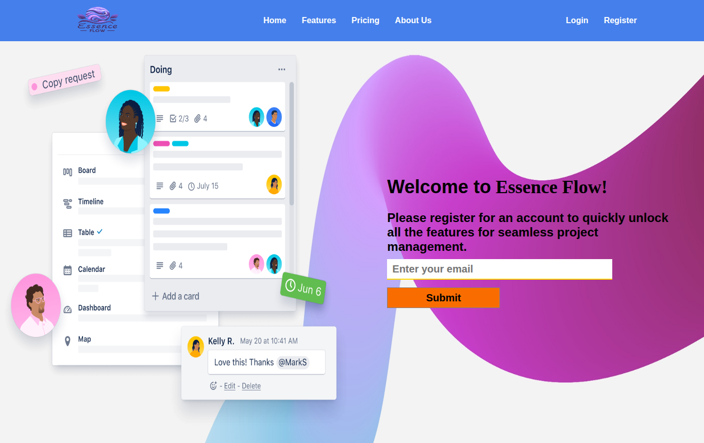
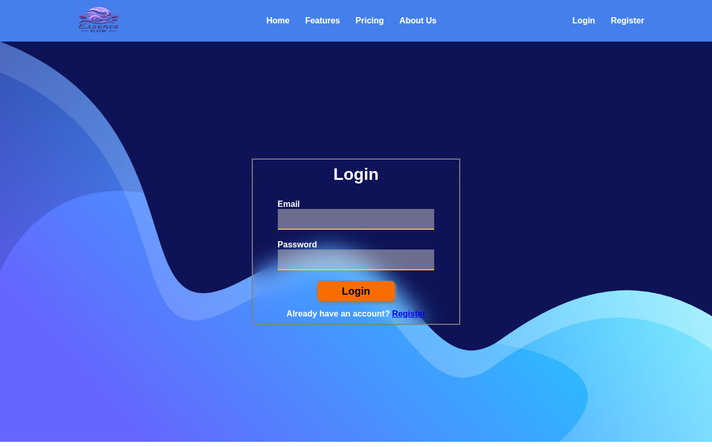

# Essence Flow — Project Management Dashboard

A web app for teams to plan and track projects. Users register, create projects with a deadline
and team members, break them into tasks, move tasks through stages, and follow progress in
reports. Built with **Node.js, Express, MongoDB and EJS**.



## Features

- **Accounts**: registration and login with hashed passwords (bcrypt) and JWT stored in an
  HTTP-only cookie. Password change from the profile page.
- **Projects**: create, edit and delete projects with a description, deadline and team members
  with roles.
- **Tasks**: add tasks to a project, move them between categories (for example *to do*,
  *in progress*, *done*) and delete them.
- **Teams and reports**: see the teams you work with and an overall progress report.
- **Search and pagination** across your projects.
- **Email notifications** through Gmail (Nodemailer).

## Tech stack

| Area       | Choice                                          |
| ---------- | ----------------------------------------------- |
| Server     | Node.js, Express 4                              |
| Views      | EJS templates, CSS                              |
| Database   | MongoDB with Mongoose                           |
| Auth       | bcryptjs, jsonwebtoken, express-session         |
| Email      | Nodemailer                                      |
| Deployment | Render blueprint (`render.yaml`)                |

## Project structure

```text
├── index.js          # App setup: middleware, sessions, routes
├── routes/           # normal.js (public pages, login/register), dashboard.js (signed-in area)
├── controllers/      # auth, dashboard, project and task handlers
├── middleware/       # JWT verification
├── Schema/           # Mongoose schemas (User, Project)
├── models/           # Data access helpers
├── utils/db.js       # MongoDB connection
├── views/            # EJS pages and partials
└── public/           # CSS, client-side scripts and images
```

## Getting started

Requires Node.js 18+ and MongoDB (local, Docker, or a free MongoDB Atlas cluster).

```bash
npm install
cp .env.example .env    # then fill in the values
npm run dev             # starts with nodemon at http://localhost:3000
```

To run MongoDB locally with Docker:

```bash
docker run -d -p 27017:27017 --name pms-mongo mongo:7
```

### Environment variables

| Variable         | Required        | Description                                         |
| ---------------- | --------------- | --------------------------------------------------- |
| `MONGODB_URI`    | Yes             | MongoDB connection string                           |
| `SECRET_KEY`     | In production   | Key used to sign login tokens                       |
| `SESSION_SECRET` | In production   | Key used to sign session cookies                    |
| `MAIL_USER`      | For email       | Gmail address used to send emails                   |
| `MAIL_PASSWORD`  | For email       | Gmail [app password](https://support.google.com/accounts/answer/185833) |
| `PORT`           | No              | Port to listen on (default 3000)                    |

## Main routes

| Method | Path                                                  | Description                 |
| ------ | ----------------------------------------------------- | --------------------------- |
| GET    | `/`, `/login`, `/register`                            | Landing, login and sign-up  |
| GET    | `/dashboard`                                          | Dashboard home              |
| GET    | `/dashboard/myProjects`                               | Your projects (paginated)   |
| GET    | `/dashboard/projects/:projectId`                      | Project board with tasks    |
| POST   | `/dashboard/create`                                   | Create a project            |
| POST   | `/dashboard/projects/:projectId/newTask`              | Add a task                  |
| POST   | `/dashboard/projects/:projectId/tasks/:taskId/updateCategory` | Move a task         |
| GET    | `/dashboard/teams`, `/dashboard/reports`              | Teams and progress reports  |
| GET    | `/dashboard/search`                                   | Search projects             |

## Deployment

The repository includes a [Render](https://render.com) blueprint. Create a new Blueprint on
Render from this repository, then set `MONGODB_URI` (and the mail settings if you need email).
`SECRET_KEY` and `SESSION_SECRET` are generated automatically.

## Screenshots

| Login                                   |
| --------------------------------------- |
|  |
